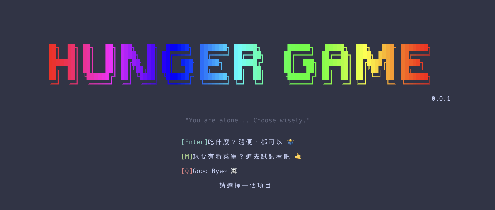

# Hunger Game 🎲💸



## 關於 Hunger Game

**Hunger Game** 是一款有趣的命令列工具，專為那些「今天吃什麼？」決策困難的人類設計！透過簡單的互動介面，幫你從已儲存的餐點中隨機挑選，讓吃飯決策變得輕鬆愉快。

### 主要特色

- 🎯 **智慧挑選**: 根據你的喜好程度權重來推薦餐點
- 📝 **輕鬆管理**: 簡單新增、編輯餐點資料
- 🎨 **美觀介面**: 彩色命令列介面，操作直覺
- 💾 **本地儲存**: 資料安全儲存在本地，不用擔心隱私

## 🚀 安裝指南

### 系統需求

- Node.js 16 或以上版本
- npm 或 yarn

### 安裝步驟

```bash
# 全域安裝
$ npm install --global hunger-game

# 或使用 npx 直接執行（無需安裝）
$ npx hunger-game
```

## 📖 使用指南

### 啟動應用程式

安裝完成後，在終端機輸入：

```bash
$ hunger-game
```

### 主要功能

#### 1. 首頁

- 顯示歡迎畫面和操作說明
- 按 **Enter** 開始餐點挑選
- 按 **M** 進入餐點管理
- 按 **Q** 退出程式

#### 2. 餐點挑選

- 系統會根據你的經濟狀況顯示適合的餐點
- 顯示兩個隨機挑選的餐點選項
- 按 **R** 重新挑選
- 按 **Q** 退出

#### 3. 餐點管理

- **新增餐點**: 輸入餐點名稱、喜好程度（1-5 分）、標籤、描述
- **編輯餐點**: 修改現有餐點資訊
- **刪除餐點**: 移除不需要的餐點

### 輸入說明

#### 新增餐點時的格式

```
餐點名稱,喜好程度,標籤,描述
```

**範例：**

```
牛肉麵,5,中式,經典台灣小吃
Pizza,4,義式,起司超多
壽司,3,日式,新鮮海鮮
```

#### 欄位說明

- **餐點名稱**: 必填，1-50 個字元
- **喜好程度**: 必填，1-5 的整數（5 分最喜歡）
- **標籤**: 選填，描述餐點類型（如：中式、日式、素食等）
- **描述**: 選填，餐點的詳細說明

### 經濟狀況選項

應用程式會根據你的經濟狀況來篩選餐點：

- 💸 **錢包空空**: 適合便宜的餐點
- 🪙 **有一些零錢**: 中等價位的選擇
- 💵 **小有積蓄**: 稍微貴一點的餐點
- 🏦 **穩健富足**: 高品質餐點
- 🚀 **財富自由**: 頂級餐廳選擇

## ❓ 常見問題

**Q: 我的餐點資料會儲存在哪裡？**
A: 資料會安全儲存在你電腦的本機資料庫中，不會上傳到任何伺服器。

**Q: 可以修改已新增的餐點嗎？**
A: 目前版本支援新增和刪除餐點，修改功能正在開發中。

**Q: 為什麼有些餐點沒有出現？**
A: 系統會根據你選擇的經濟狀況來篩選餐點。如果沒有符合條件的餐點，請先新增更多選擇。

**Q: 如何完全移除所有資料？**
A: 刪除 `~/.hunger-game/db.sqlite` 檔案即可清除所有資料。

## 🤝 貢獻

歡迎回報問題或建議新功能！請在 [GitHub Issues](https://github.com/your-username/hunger-game/issues) 提出。

---
